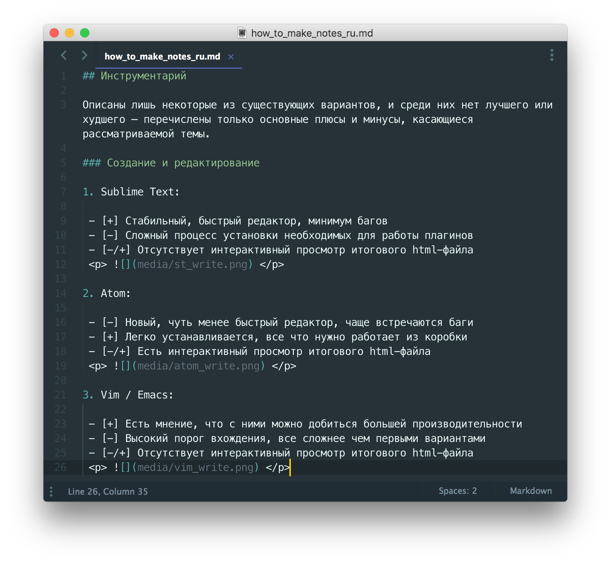
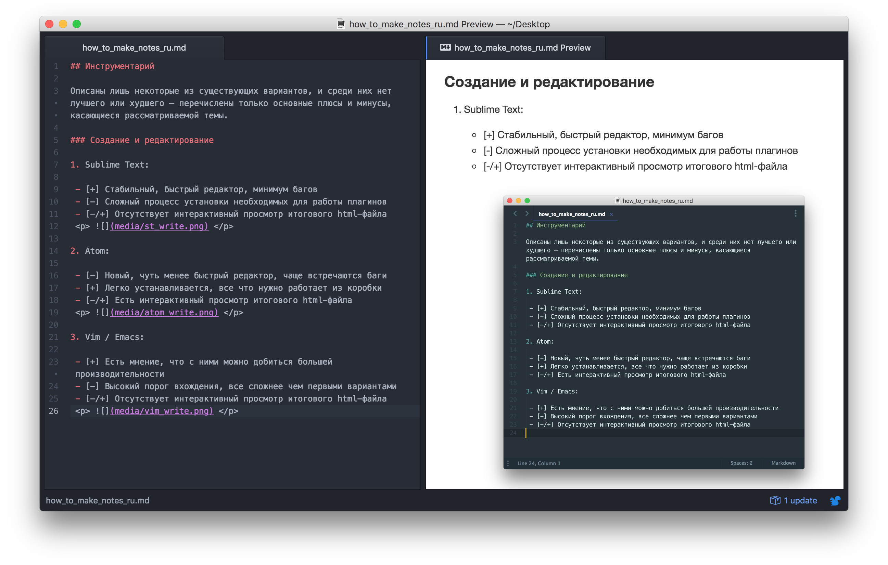
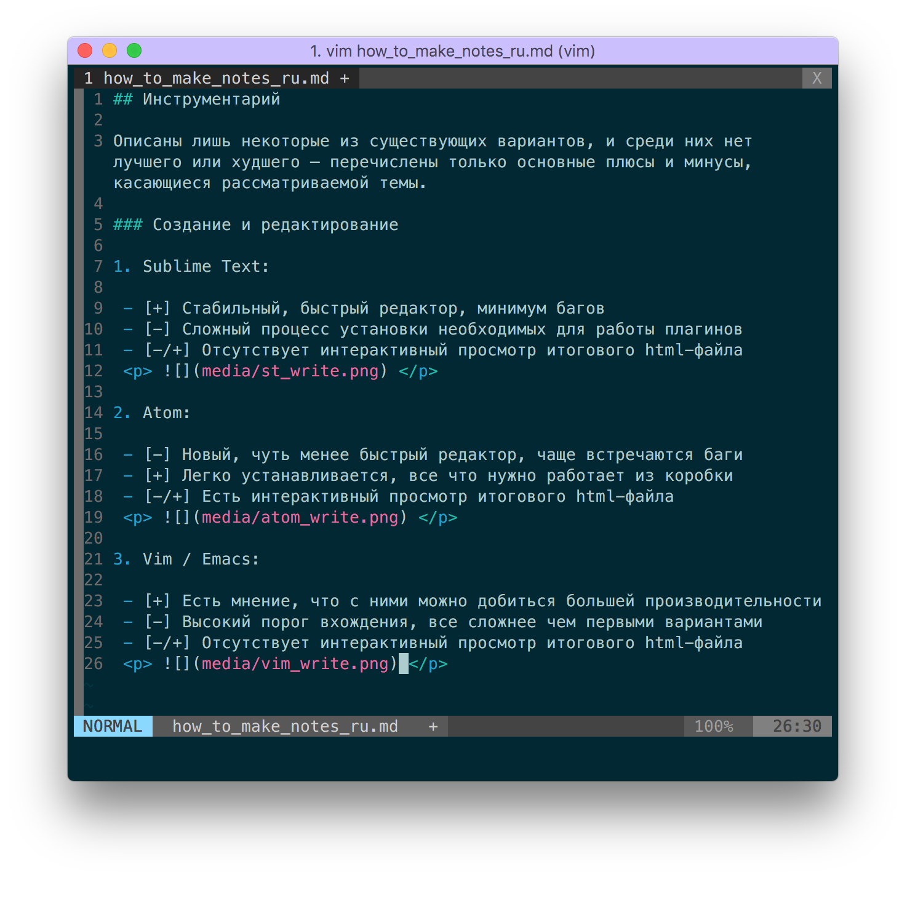

# Еще один способ вести заметки

В данном документе рассматривается очень простой и мощный метод накопления знаний. Кроссплатформенный, легкий и красивый. Этот медот предоставляет взможность создать свою собственную wiki-подобную базу знаний. Легко писать, редактировать, искать и распространять.

## Краткое описание

Заметки ведутся в плоских текстовых файлах в разметке [Markdown](https://ru.wikipedia.org/wiki/Markdown), посредством продвинутых текстовых редакторов, после чего компилируются в html (опционально) и читаются в браузере.

## Необходимые условия

- Персональный компьютер
- Операционная система:
    + Unix-подобная (Linux, macOS)
    + MS Windows
- Знание [синтаксиса облегченного языка разметки Markdown](https://github.com/adam-p/markdown-here/wiki/Markdown-Cheatsheet)

## Обзор инструментария

Описаны лишь некоторые из существующих вариантов, и среди них нет лучшего или худшего — перечислены только основные плюсы и минусы, касающиеся рассматриваемой темы.

### Создание и редактирование

1. Sublime Text:

 - [+] Стабильный, быстрый редактор, минимум багов
 - [-] Сложный процесс установки необходимых для работы плагинов
 - [-/+] Отсутствует интерактивный просмотр итогового html-файла
 <p>  </p>

2. Atom:

 - [-] Новый, чуть менее быстрый редактор, чаще встречаются баги
 - [+] Легко устанавливается, все что нужно работает из коробки
 - [-/+] Есть интерактивный просмотр итогового html-файла
 <p>  </p>

3. Vim / Emacs:

 - [+] Есть мнение, что с ними можно добиться большей производительности
 - [-] Высокий порог вхождения, все сложнее чем первыми вариантами
 - [-/+] Отсутствует интерактивный просмотр итогового html-файла
 <p>  </p>

### Компиляция в html

1. Sublime Text:

 - [+] Компилиляция md-файлов в html высокого качества в различных стилях (в т.ч. в стиле github)
 - [-] Сложный процесс установки необходимых для работы плагинов

2. Atom:

 - [-] Компилиляция md-файлов в html низкого качества в различных стилях (не умеет стиль github)
 - [+] Все работает из коробки

3. Vim / Emacs — использование Pandoc:

 - [+] Компилиляция md-файлов в html высокого качества в различных стилях (не умеет стиль github)
 - [+] Переформатирование из html в md и множетсво других форматов, таких как pdf, ebup, docx, odt, tex и др
 - [-/+] Необходимо отдельно установить Pandoc

### Чтение

Если ты решил компилировать в html — используй любой браузер. В противном случае, есть несколько опций:

- Текстовый редактор. Как ты мог заметить, синтаксис подсвечивается и все вполне читабельно
- [MDwiki](http://dynalon.github.io/mdwiki/#!index.md). Компиляция «на лету» в браузере посредством одного единственного html-файла
- Если у тебя macOS, ты можешь читать md-файлы с помощью QuickLook плагина [qlmarkdown](https://github.com/toland/qlmarkdown)

## Установка инструментария

### Sublime Text

1. Загрузи и установи [Sublime Text 3](http://www.sublimetext.com/3)
2. Установи [Package Control](https://packagecontrol.io/installation)
3. Установи [Markdown Preview](https://github.com/revolunet/sublimetext-markdown-preview#installation-) плагин для Sublime Text через Package Control
4. Установи [MarkdownEditing](https://github.com/SublimeText-Markdown/MarkdownEditing) плагин для Sublime Text через Package Control
5. Установи [Material Theme](https://github.com/equinusocio/material-theme) плагин для Sublime Text через Package Control
6. Настрой в User Profile использование темы `Material Theme`:
 - Открой `Preferences` -> `Settings - User`
 - Скопируй этот текст в файл:
    ```
    {
      "always_show_minimap_viewport": false,
      "bold_folder_labels": true,
      "color_scheme": "Packages/Material Theme/schemes/Material-Theme.tmTheme",
      "flatland_sidebar_tree_xsmall": true,
      "indent_guide_options"         : [ "draw_normal", "draw_active" ],
      "font_options": // On retina Mac & Windows
      [
        "gray_antialias",
        "subpixel_antialias"
      ],
      "font_size": 14,
      "ignored_packages":
      [
        "Markdown",
        "Vintage"
      ],
      "line_numbers": true,
      "line_padding_bottom": 0.5, //was 0.5
      "line_padding_top": 0.5,
      "material_theme_small_tab": true,
      "overlay_scroll_bars": "enabled",
      // If you use Material Theme - Appbar addon you can use additional settings:
      "material_theme_tree_headings"            : true , // Show siderbar headings
      "material_theme_small_tab"                : true , // Set small tabs
      "material_theme_disable_fileicons"        : true , // Hide siderbar file type icons
      "material_theme_disable_folder_animation" : true , // Disable folder animation
      "material_theme_small_statusbar"          : true , // Set small status bar
      "material_theme_compact_sidebar"          : true , // Set compact side bar
      "material_theme_disable_tree_indicator"   : true , // Disable sidebar file indicator
      "material_theme_bold_tab"                 : true , // Make the tab labels bolder
      "material_theme_tabs_separator"           : true , // Show tabs separator, 
                                                         //this disable tab animation hover
      "material_theme_accent_lime"              : true , // set green lime accent color
      "material_theme_accent_purple"            : true , // set purple accent color
      "material_theme_accent_red"               : true , // set pale red accent color
      "material_theme_accent_orange"            : true , // set orange accent color
      "material_theme_accent_yellow"            : true , // set yellow accent color
      "material_theme_accent_indigo"            : true , // set indigo accent color
      "material_theme_panel_separator"          : true , // show bottom panel separator
      "material_theme_tabs_autowidth"           : true , // Enable autowidth for tabs
      "material_theme_contrast_mode"            : true , // Enable sidebar and panels contrast mode
      
      "theme": "Material-Theme.sublime-theme"
    }
    ```
 - Сохрани и закрой файл
7. Настрой в User Profile использование плагина `MarkdownEditing`:
 - Открой `Preferences` -> `Package Settings` -> `Markdown Editing` -> `Markdown GFM Settings - Default`
 - Открой `Preferences` -> `Package Settings` -> `Markdown Editing` -> `Markdown GFM Settings - User`
 - Скопируй содержимое `Markdown GFM Settings - Default` в `Markdown GFM Settings - User`
 - Замени линию, содержащую "color_scheme" следующим текстом:
    ```
      "color_scheme": "Packages/Material Theme/schemes/Material-Theme.tmTheme",
    ```
 - Сохрани настройки и закрой оба файла
8. Установи нужную подсветку синтаксиса: `View` -> `Syntax` -> `MarkdownEditing` -> `Markdown GFM`
9. Установи нужную систему компиляции: `Tools` -> `Build System` -> `Markdown`

#### Создание заметки

- Открой Sublime Text
- Создай новый файл (`File` -> `New File`)
- Запиши что-нибудь в синтаксисе Markdown
- Сохрани файл (`File` -> `Save`) с расширением `.md`
- Скомпилируй заметку в html (`Tools` -> `Build`). Файл появится в той же директории, что и исходный `.md`-файл

#### Чтение заметки

Открой `.html`-файл дважды кликнув на него, либо перетащив в нужный тебе браузер.

### Atom

Установи [Atom](https://atom.io/).

#### Создание заметки

- Открой Atom
- Создай новый файл (`File` -> `New File`)
- Открой вкладку интерактивного просмотра (`Packages` -> `Markdown Preview` -> `Toggle Preview`)
- Запиши что-нибудь в синтаксисе Markdown
- Сохрани файл (`File` -> `Save`) с расширением `.md`
- Сохрани файл в html-формате кликнув правой кнопкой на кладку интерактивного просмотра (`Save As HTML`)

#### Чтение заметки

Открой `.html`-файл дважды кликнув на него, либо перетащив в нужный тебе браузер.

### Vim / Emacs + Pandoc

Это hard way, и если ты достаточно умен и замотивирован чтобы идти этим путем, ты справишься с поиском информации о реализации той же функциональности, что описана выше.

## Создание простой базы знаний

Необходимо использовать понятную структуру вложенности, схему именования папок и файлов, например:

```
OFFENSIVE_SECURITY/
                   EXPLOITATION/
                                EXPLOIT_DEV/
                                            LINUX_EXPLOIT_DEV_NOTES.md
                                            WINDOWS_EXPLOIT_DEV_NOTES.md
                                METASPLOIT/
                                            METASPLOIT_NOTES.md
```

**Note:** Главное не "правильность" вложенности подразделов, а возможность быстро найти нужную информацию.

После того как структура составлена, нужно создать файлы для навигации по ней (либо один общий файл с возможностью навигации по гиперссылкам). Например:

```
# My knowledge base

## Table of contents

- OFFENSIVE SECURITY
  + EXPLOITATION
    * EXPLOIT DEVELOPMENT
      - [LINUX EXPLOIT DEVELOPMENT](file:///EXPLOITATION/EXPLOIT_DEV/LINUX_EXPLOIT_DEV_NOTES.html)
      - [WINDOWS EXPLOIT DEVELOPMENT](file:///EXPLOITATION/EXPLOIT_DEV/WINDOWS_EXPLOIT_DEV_NOTES.html)
    * [METASPLOIT](file:///EXPLOITATION/METASPLOIT/METASPLOIT_NOTES.md)
[...]
```

Когда ты создашь такой файл и откроешь его в браузере, должно получиться что-то подобное:

---

# My knowledge base

## Table of contents

- OFFENSIVE SECURITY
  + EXPLOITATION
    * EXPLOIT DEVELOPMENT
      - [LINUX EXPLOIT DEVELOPMENT](file:///EXPLOITATION/EXPLOIT_DEV/LINUX_EXPLOIT_DEV_NOTES.html)
      - [WINDOWS EXPLOIT DEVELOPMENT](file:///EXPLOITATION/EXPLOIT_DEV/WINDOWS_EXPLOIT_DEV_NOTES.html)
    * [METASPLOIT](file:///EXPLOITATION/METASPLOIT/METASPLOIT_NOTES.html)

---

Если ты не ошибся с путями, клик по ссылке перенаправит тебя на выбранную заметку.

**Attention:** необходимо использовать [**относительные ссылки**](https://github.com/blog/1395-relative-links-in-markup-files) к `.html`-файлам. В таком случае ссылки будут кликабельны не только на твоем компьютере (что важно, если ты планируешь делиться своими заметками).

## Ссылки

- Облегченный язык разметки [Markdown](https://ru.wikipedia.org/wiki/Markdown)
- [Синтаксис Markdown](https://github.com/adam-p/markdown-here/wiki/Markdown-Cheatsheet)
- CMS/Wiki система [MDwiki](http://dynalon.github.io/mdwiki/#!index.md)
- QuickLook плагин для чтения markdown [qlmarkdown](https://github.com/toland/qlmarkdown)
- Продвинутый текстовый редактор [Sublime Text 3](http://www.sublimetext.com/3)
- Менеджер пакетов [Package Control](https://packagecontrol.io/installation)
- Плагин [Markdown Preview](https://github.com/revolunet/sublimetext-markdown-preview#installation-)
- Плагин [MarkdownEditing](https://github.com/SublimeText-Markdown/MarkdownEditing)
- Тема [Material Theme](https://github.com/equinusocio/material-theme)
- Продвинутый текстовый редактор [Atom](https://atom.io/)
- [Github: Относительные ссылки в Markdown](https://github.com/blog/1395-relative-links-in-markup-files) 

## Дополнительные материалы

- [VimWiki](https://vimwiki.github.io)
- [Ask HN: How are you taking notes](https://news.ycombinator.com/item?id=11461985)
- [Ask HN: What are your note-taking techniques?](https://news.ycombinator.com/item?id=9976751)
- [Ask HN: How do you take notes?](https://news.ycombinator.com/item?id=13271330)
