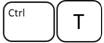
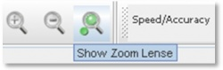
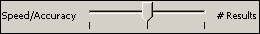
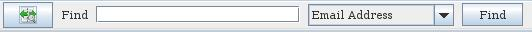
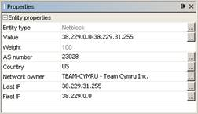

# Руководство пользователя Maltego (Коммерческая версия)

Это руководство описывает работу с коммерческой версией программы Maltego. Бесплатная версия Maltego достаточно проста, поэтому между ними существуют некоторые различия в использовании.

Maltego может работать под управлением операционных систем Windows и Linux. Это руководство подразумевает, что у вас уже установлена Java 1.6. 

Hint: Если у вас появятся вопросы, не рассмотренные ниже, то пожалуйста, [свяжитесь с нами](http://ctas.paterva.com/view/Contact_Us).

## Содержание

- [Руководство пользователя Maltego (Коммерческая версия)]()
- [Установка]()
    + [Windows]()
    + [Linux]()
    + [Mac]()
- [Первый запуск и регистрация]()
- [Переход от версии 2.0 к версии 2.0.1]()
- [Создание первого графа]()
- [Навигация]()
    + [ Масштабирование]()
    + [ Масштабирование при помощи указателя мыши \[для версии 2.0.1\]]()
    + [ Увеличительное стекло \[для версии 2.0.1\]]()
    + [ Перемещение по графу]()
    + [ Копирование и вставка \[для версии 2.0.1\]]()
        * [Копирование]()
        * [Вставка объектов без связей с другими]()
        * [Вставка объектов с взаимосвязями]()
        * [Вставка из текста]()
- [Запуск преобразований]()
- [Отмена запущенных преобразований \[для версии2.0.1\]]()
- [Установка количества возвращаемых результатов]()
- [Выбор объектов]()
    + [Выбор одного объекта]()
    + [Выбор нескольких объектов]()
    + [Выбор отдельных объектов]()
    + [Выбор дочерних объектов]()
    + [Выбор дочерних объектов вместе с родительским]()
    + [Выбор родительского объекта]()
    + [Выбор родительского объекта вместе с дочерними]()
    + [Выбор объектов с использованием поиска]()
    + [Инвертированный выбор \[для версии 2.0.1\]]()
    + [Комбинации]()
    + [Быстрый список входящих и исходящих связей]()
- [Виды и компоновка]()
    + [Компоновка]()
    + [Виды]()
- [Свойства объекта & Детализированный вид]()
    + [Свойства объекта]()
    + [Детализированный вид объекта]()
- [Менеджер преобразований]()
    + [Редактирование преобразований]()
        * [Изменение отображаемого названия преобразования]()
        * [Дублирование преобразований]()
    + [Процесс поиска преобразований]()
    + [Наборы преобразований]()
        * [Создание новых наборов]()
        * [Добавление/удаление преобразований из наборов]()
        * [Удаление наборов]()
- [Сохранить, открыть]()
- [Экспорт]()
- [Печать]()

<!--
- [1 Руководство пользователя Maltego (Коммерческая версия)]()
- [2 Установка]()
    + [2.1 Windows]()
    + [2.2 Linux]()
    + [2.3 Mac]()
- [3 Первый запуск и регистрация]()
- [4 Переход от версии 2.0 к версии 2.0.1]()
- [5 Создание первого графа]()
- [6 Навигация]()
    + [6.1 Масштабирование]()
    + [6.2 Масштабирование при помощи указателя мыши \[ Для 2.0.1 \]]()
    + [6.3 Увеличительное стекло \[ Для 2.0.1 \]]()
    + [6.4 Перемещение по графу]()
    + [6.5 Копирование и вставка \[ Для Of 2.0.1 \]]()
        * [6.5.1 Копирование]()
        * [6.5.2 Вставка объектов без связей с другими]()
        * [6.5.3 Вставка объектов с взаимосвязями]()
        * [6.5.4 Вставка из текста]()
- [7 Запуск преобразований]()
- [8 Отмена запущенных преобразований \[ для версии2.0.1 \]]()
- [9 Установка количества возвращаемых результатов]()
- [10 Выбор объектов]()
    + [10.1 Выбор одного объекта]()
    + [10.2 Выбор нескольких объектов]()
    + [10.3 Выбор отдельных объектов]()
    + [10.4 Выбор дочерних объектов]()
    + [10.5 Выбор дочерних объектов вместе с родительским]()
    + [10.6 Выбор родительского объекта]()
    + [10.7 Выбор родительского объекта вместе с дочерними]()
    + [10.8 Выбор объектов с использованием поиска]()
    + [10.9 Инвертированный выбор \[Для 2.0.1\]]()
    + [10.10 Комбинации]()
    + [10.11 Быстрый список входящих и исходящих связей]()
- [11 Виды и компоновка]()
    + [11.1 Компоновка]()
    + [11.2  Виды]()
- [12 Свойства объекта & Детализированный вид]()
    + [12.1 Свойства объекта]()
    + [12.2 Детализированный вид объекта]()
- [13 Менеджер преобразований]()
    + [13.1 Редактирование преобразований]()
        * [13.1.1 Изменение отображаемого названия преобразования]()
        * [13.1.2 Дублирование преобразований]()
    + [13.2 Процесс поиска преобразований]()
    + [13.3 Наборы преобразований]()
        * [13.3.1 Создание новых наборов]()
        * [13.3.2 Добавление/удаление преобразований из наборов]()
        * [13.3.3 Удаление наборов]()
- [14 Сохранить, открыть]()
- [15 Экспорт]()
- [16 Печать]()
-->

## Установка

### Windows

После загрузки файла `MaltegoInstaller.exe` двойной клик по нему запускает процесс установки. Установщик выполнен с использованием Izpack – это распространенный установщик Java-приложений, который не зависит от платформы. Следуйте инструкциям по умолчанию. По желанию, вы можете добавить иконку программы на Рабочий стол, с помощью меню на последнем экране.


После установки вы увидите иконку на Рабочем столе, а также в меню Пуск во вкладке Paterva -&gt; Maltego.

### Linux

Для установки в Linux у вас должна быть система (окон) Х11, так как – Maltego является графическим приложением. После загрузки откройте терминал. Вы должны поменять директорию, куда был загружен файл `MaltegoInstaller.jar`, например:

```
> *cd downloads/maltego* (допустим, что вы загрузили файл сюда)
```

Из этой директории нужно запустить Java установщик, используя следующую команду:

```
> *java –jar MaltegoInstaller.jar*
```

Запустится графический установщик. Так же, как и в установке в систему Windows, вы можете создать значок приложения на Рабочем столе. Установщик добавит его на Рабочий стол сред KDE или Gnome – для других сред проверка не проводилась.

**Примечание 1**: Убедитесь на 100%, что у вас есть права на чтение и запись в директории, в которую вы устанавливаете приложение – например, если вы установили приложение как root, а запускаете его как обычный пользователь, существует возможность ошибки чтения и записи фалов конфигурации.

**Примечание 2**: Если у вас установлено несколько версий Java на компьютере, убедитесь, что используете версию 1.6 для Maltego. Лучшим способом перевести Maltego на использование новой версии Java, это запустить его из командной строки следующим образом:

```
> \[Директория установки Maltego\]/bin/*maltego --jdkhome /path/to/your/java/install/*
```

### Mac

Коммерческую версию приложения для макинтош можно скачать как `.pkg` файл отсюда: <http://www.paterva.com/maltego/download/>. Файл `.pkg` является исполняемым и установщик проведет инсталляцию. 

Вам также будет надо установить Java 1.6 (для пользователей двухъядерных компьютеров Mac) или Soylatte Java (для пользователей 32-битных Mac). Чтобы получить больше информации вы можете прочитать пост на форуме — здесь: <http://www.paterva.com/forum/index.php/topic,84.0.html> 

## Первый запуск и регистрация

Во время первого запуска Maltego вы увидите начальный экран:


Заметьте, что части этой заставки имеют динамическое содержимое и будут меняться время от времени.

Maltego является коммерческим продуктом и использует лицензионный ключ для своей активации. Лицензионный ключ действителен в течении одного года для одного компьютера. Без действующего лицензионного ключа вы можете использовать Maltego исключительно для просмотра файлов, созданных другими пользователя – вы не можете создавать графы, добавлять или редактировать существующие. Чтобы зарегистрироваться, кликните на красный текст "Зарегистрируйтесь перед использованием Maltego. Кликните здесь, чтобы зарегистрироваться сейчас". Это запустит мастер регистрации.

Введите свой лицензионный ключ, который был выслан вам по электронной почте. Ключ имеет контрольную цифру (последняя цифра) для проверки, что вы не сделали опечатку. Если ключ был введен верно, появится слово "Valid" (действующий ключ). Если неверно, то появится слово "Invalid" (недействующий ключ):


Нажмите "Далее". Вам нужно выбрать сетевой адаптер для проведения установки. Выберите адаптер, который не будет меняться в дальнейшем.


Если вы используете Linux вам предлагается выбрать адаптер 'eth0' по умолчанию. Нажмите "Далее". Приложение проверит действительность лицензии. Примечание: вы можете использовать одну лицензию только один раз. Если лицензия действует, программа запустится. На экране появится сводка из регистрационной информации.


Начальная страница будет обновлена, и на ней будет отображаться информация о регистрации:


## Переход от версии 2.0 к версии 2.0.1

[Кликните по ссылке для просмотра руководства по переходу между версиями Maltego для Windows Vista, Windows XP и Linux.](migration_from_older_versions_ru.md)

## Создание первого графа



Чтобы начать создание нового графа, нажмите на кнопку:


Так же, вы можете кликнуть на значке 'New' (Новый) который находится чуть ниже меню \[File\] для создания нового графа в любой момент времени, или использовать сочетание клавиш Ctrl-T (новая вкладка).

Появится пустое поле, которое выглядит так:


Вы можете открывать несколько графов одновременно. Новые графы будут добавляться во вкладки наверху экрана.

Чтобы вернуться на стартовую страницу кликните по вкладке 'Start Page' (стартовая страница), либо перейдите в меню Help -&gt; Start Page (Помощь-&gt;Стартовая страница). Для получения API программы, информации о регистрационном ключе и регистрации откройте меню Help -&gt; About Maltego. (Помощь-&gt;О Maltego). Страница с данной информацией выглядит следующим образом:


Вы можете просмотреть здесь статус вашей лицензии и лицензионный ключ, API ключи.

Если вы хотите убедиться, что ваши ранее сконфигурированные настройки преобразований (Transforms) были обнаружены и индексированы, то выберите в меню Tools-&gt;Manage transforms. Вы увидите:


Note: Существует список преобразований, и наличие зеленой пометки слева означает, что они готовы к использованию. Для получения дополнительной информации об управлении принципами преобразований (Transforms) смотрите соответствующий раздел в этой документации.

Далее, для того, чтобы добавить объекты в окно нового графа, выберите объект, например, "Domain" (Домен) из списка и перетащите его в окно с графом:


Первое, что вы должны заметить, что объект содержит три числа и значение.


Значения:

- `Entity icon` – значок объекта  
- `# of incoming links` – количество входящих связей  
- `# of outgoing links` – количество исходящих связей  
- `Weight` – вес  
- `Value` — значение  

Чтобы редактировать имя объекта (в данном случае домена) – дважды кликните по нему. Объект будет выбран, и вы сможете изменять текст в выделенной области:


## Навигация

### Масштабирование


Увеличивать и уменьшать масштаб можно с помощью колеса прокрутки мыши. Если вы используете ноутбук, вы можете использовать кнопки:


При отдалении вида графа вы увидите, что он меняется с точки зрения детализации - по определенному принципу. Это происходит так, что становится невозможно прочитать названия объектов определенного узла. Но это означает, что данные детали не являются важными и их отображение не несет основного смысла. В этом режиме просмотра различные объекты отображаются как значки различных цветов. Так же отображается маленькая легенда соответствия цветов типам объектов в правом нижнем углу графа:


Заметьте, что цвета не всегда одни и те же, то есть объект - IP адрес не всегда может отображаться голубым на разных графах. Это происходит по причине того, что в Maltego могут быть объекты, созданные пользователем и количество объектов, которые будут использоваться программе заранее не известно.

Note: В Версии 2.0.1 при масштабировании относительно указателя мыши с помощью колеса прокрутки, будет использоваться следующий метод.

### Масштабирование при помощи указателя мыши \[для версии2.0.1\]

Масштабирование относительно указателя мыши в версии 2.0.1 было улучшено. Если предыдущий метод масштабирования основывался на приближении и отдалении графа относительно центра, то новый метод основывается на масштабировании относительно положения указателя мыши.

Например, если указатель мыши был в крайнем левом углу конкретного графа, увеличение будет означать, что граф будет медленно перемещается влево, пока центральная точка не окажется там, где был курсор, а не то, что центральная точка является центром графа.

### Увеличительное стекло \[для версии2.0.1\]

Увеличительное стекло является способом навигации по графу, с помощью которого вы можете быстро увеличить определенную часть графа, не приближая его целиком. Эта функция включается при выборе в меню view-&gt;show zoom Lense, или при нажатии на иконку с увеличительным стеклом наверху панели инструментов Maltego.




При выборе этого пункта меню, указатель мыши будет изменён на схематичное изображение увеличительного стекла. При помощи этого эффекта доступно управление степенью увеличения изображения, и вы сможете изменять ее с помощью колеса мыши.


Чтобы отключить эту функцию, выберете увеличительное стекло повторно, одним из указанных выше способов.

### Перемещение по графу


Для перемещения по графу вы можете использовать полосы прокрутки по краям окна, или щелчок правой кнопкой мыши и перетаскивание. Этот способ навигации быстрее, чем с использованием полосы прокрутки.

Вы также можете использовать "вид со спутника" (Satellite view) для навигации. Это полезный метод для навигации по большим графам.


Перемещайте серую рамку по окну "вид со спутника" (Satellite view) зажав правую кнопку мыши, и главное окно графа будет обновляться в режиме реального времени. В зависимости от уровня масштабирования рамка становится больше (отдалено) или меньше (приближено).

### Копирование и вставка \[для версии 2.0.1\]

#### Копирование


Скопировать объект можно выделив его и нажав CTRL+C или выбрав в меню Edit-&gt; Copy (как показано выше), а также с помощью других способов, описанных в данной части.

#### Вставка объектов без связей с другими


Объекты могут быть перенесены и вставлены в стороннее приложение либо в граф Maltego (без отношений) без связей с другими объектами. Это можно сделать либо нажатием Ctrl+V, либо выбрав Edit-&gt;Paste (Правка-&gt; Вставить) (как показано выше).

Скопированные объекты, которые будут вставлены в любое внешнее (стороннее) приложение будут иметь значения выбранных узлов. Например, выделяя объекты графа и копируя их в текстовой редактор (в данном случае Windows Notepad), вы увидите, что будут перенесены значения всех скопированных объектов (второй пример).


#### Вставка объектов с взаимосвязями


Чтобы сохранить информацию о взаимоотношениях между объектами (связями между объектами) в графах, выберите Edit-&gt; Paste Special ... (как показано выше). Вы увидите диалоговое окно, которое позволит вставить скопированные объекты с их связями. Выберите первый пункт меню (Paste entities and links) для сохранения отношений между объектами при переносе в другой граф.


#### Вставка из текста

Объекты также могут быть вставлены из текста, путем его выделения и копирования (как и в любом текстовой процессоре или ином приложении), с помощью одного из методов, описанных выше.

Также, Maltego попытается определить, какой тип объекта был скопирован, и на основе его значения будет выбирать подходящий для него тип объекта для вставки в граф.

Например, если вы скопировали следующее, как текст:

-   Andrew@punks.co.za
-   Andrew MacPherson
-   Punks.co.za
-   www.punks.co.za
-   punk south Africa

Maltego бы интерпретировал эти объекты, как следующие в графе:

-   Email Address
-   Name
-   Domain
-   DNS Name
-   Phrase

И объекты на выходе выглядели бы служащим образом:


Note: нахождение соответствий между вставленным текстом и типом объекта не идеально, но достаточно близко к этому!

## Запуск преобразований


Для запуска вашего первого преобразования кликните правой кнопкой на объекте. Вы увидите список, выглядящий следующим образом:


Предположим, что мы хотим найти существующие записи о MX (Mail exchanger – приложение для обмена почтой) для заданного домена. Мы будем использовать преобразование 'To MX records \[DNS\]', для этого, нажмите на него правой кнопкой мыши.

В правом нижнем углу мы видим индикатор состояния преобразования, показывающий, что мы проводим одно действие над одним объектом.


При выполнении нескольких преобразований над несколькими объектами одновременно, индикатор выполнения будет показывать прогресс. При запуске одного преобразования над одним объектом, индикатор будет показывать только активность.

Экран с результатами выполнения преобразования выглядит следующим образом:


Note: Экран "Output", содержит подробную информацию о выполнении преобразования. Она очень полезна, так как некоторые преобразования могут выводить на него дополнительную информацию.

## Отмена запущенных преобразований \[для версии2.0.1\]

После запуска преобразования вы можете наблюдать индикатор прогресса в правом нижнем углу экрана, он будет двигаться в ожидании завершения действия:


\[X\] (крестик справа в строке состояния) позволяет отменить преобразование (например - если вы выбрали неверное преобразование и не хотите, чтобы результаты исказили ваш граф добавлением неверных объектов).

Для отмены выполняемого преобразования, выберите \[X\] в нижней части экрана. Будет открыто диалоговое окно, которое выглядит так:


Выбрав "Yes", вы отмените выполнение запущенных преобразований. Выбрав "No", выполнение преобразований будет продолжено.

При выполнении нескольких преобразований одновременно, нажатие на \[Х\] отменит все текущие преобразования. Если вы хотите остановить конкретное преобразование, вам следует нажать на строку состояния, которая покажет все запущенные преобразования. Там вы сможете выбрать то, что вы хотите отменить, выполнив все описанные выше действия.

Note: При запуске набора преобразований вы можете отменить только выполнение всего набора!

## Установка количества возвращаемых результатов

В верхней части программы Maltego установлен ползунок:



При установке ползунка в крайнее левое положение, Maltego будет выдавать 12 лучших результатов поиска, исходя из веса найденного объекта. Установка ползунка в среднее положение соответствует 50-ти результатам, крайнее правое положение – 255-ти результатам. Нужно не забывать о возможных последствиях выбора этих параметров. Многие преобразования не используют понятия веса. Только поисковая система использует вес, как показатель значимости результата. Например, результатов DNS для сети класса C, потенциально – 255, каждому из них будет присвоено значение 100 (значение по умолчанию), так как они все равноценны между собой. Установка ползунка в крайнее левое положение покажет только первые 12 результата, что полезно для получения представления о сети, но бесполезно для получения полной информации DNS блока. В то же время, установка ползунка на 255 результатов (например, во время поиска чего-либо конкретного, но с достаточно общим названием) – не достаточно умна, и вы получите слишком много результатов.

В следующих версиях инструмент будет различать "Перебор" и "Поиск" преобразований, где ползунок будет относиться только к "Поиску". На данный момент вы должны быть аккуратны, и изучить принцип работы ползунка, экспериментируя с ним.

## Выбор объектов

В Maltego существует несколько способов выбора объектов.

### Выбор одного объекта


При нажатии на объект, вокруг него появляется синяя рамка. При отдалении изображения выбранного объекта, цвет выделения будет становиться ярче.

### Выбор нескольких объектов

Вы можете выделять сразу несколько объектов, рисуя вокруг них рамку с нажатой левой кнопки мыши:


После того, как вы отпустите левую кнопку мыши, объекты будут выбраны:


### Выбор отдельных объектов


Вы можете выбирать объекты по одному кликая по ним с зажатой клавишей Shift:


### Выбор дочерних объектов


Возможность выбрать все дочерние объекты (например, все объекты, связанные с одним) – очень полезна. Это можно сделать, выбрав родительский объект и нажав Ctrl + Стрелку вниз.


### Выбор дочерних объектов вместе с родительским


Вы можете выбрать дочерние объекты вместе с родительским нажав Control + Shift + Стрелку вниз. Это полезно, чтобы выбрать сразу все семейство объектов:


### Выбор родительского объекта


Вы можете выбрать родительский узел (например, источник выбранного объекта), выбрав дочерний узел и нажав Ctrl + Стрелку вверх. Это нужно, чтобы добраться до первоисточника текущего объекта.


### Выбор родительского объекта вместе с дочерними


Выбрав дочерний объект и нажав Control + Shift + Стрелку вверх, вы можете выбрать родительский объект и все дочерние сразу. Это полезно при выборе семейства объектов опираясь на дочерний узел.


### Выбор объектов с использованием поиска


Чтобы начать поиск, нажмите Control + F. Появится следующее окно:


Введите ключевое слово для поиска и нажмите "Find" (Найти), все записи, соответствующие критерию, будут выделены:


Для получения более подробной информации о поиске объектов, пожалуйста, обратитесь к соответствующему разделу в этом документе.

### Инвертированный выбор \[для версии2.0.1\]



Инвертированный выбор позволяет изменять выбор объектов. Например, если вы выбрали все IP-адреса из графа, а затем нажали на кнопку инвертированного выбора (если смотреть сверху – слева), то будут выделены все объекты, кроме IP-адресов.

### Комбинации

Лучший способ выбора объектов представляет собой сочетание всех указанных выше способов. Например, вы можете выбирать отдельные объекты и использовать комбинации поиска дочерних / родительских связей, чтобы найти то, что вы ищете.

### Быстрый список входящих и исходящих связей


При работе с большими графами, возможно, что родительские и дочерние связи объекта находятся за пределами границ текущего графа. Чтобы быстро получить список родительских и дочерних связей объекта нажмите Control+ЛКМ на значке объекта. Вы увидите отдельное окно, в котором будет список всех входящих и исходящих связей объекта:


## Виды и компоновка

### Компоновка

Maltego поддерживает 4 вида компоновки объектов:

1.  
Компоновка блоками. Этот вид расположения используется по умолчанию и во время сбора информации. Этот вид будет описан более подробно ниже.

2.  Иерархическая компоновка. Расположение элементов в виде древа (как файл-менеджер).

3.  Централизованная компоновка. Наиболее важные узлы графа (например, наиболее частые связи) отображаются ближе к центру, соединяясь с другими, менее важными, вокруг них.

4.  Органическая компоновка. Взаимосвязанные узлы располагаются близко друг другу, так, что пути между ними минимальны.

Вы можете переключаться между режимами просмотра в любое время, нажав на соответствующую иконку (расположенную в верхней части окна графа). Выделение объектов будет сохранено при переключении вида расположения объектов.

Компоновка объектов в виде блоков используется при поиске информации, поэтому приложение всегда будет переключаться на этот вид при получении новых результатов поиска. В данном виде компоновки объектов используются следующие правила:

1.Использование блоков узлов
2.Сортировка по типу объекта
3.Сортировка по весу объекта

Рассмотрим следующий граф, где были выполнены два преобразования с объектом Person – Person2EmailAddress and Person2Website:


Обратите внимания, что объекты рассортированы по типу и весу.

На следующих изображениях будет показан один и тот же граф с компоновками объектов по различным принципам. На графе показаны все связанные с компанией Paterva DNS имена, их IP-адреса, сети, к которым они принадлежат, и количество этих сетей. Заметьте, что большая часть графов приведена в режиме "Обзор (Предпросмотр)", для того, чтобы рассмотреть детально компоновку блоками:


Компоновка блоками (отдаление / предпросмотр):


Иерархическая компоновка элементов:


Централизованная компоновка:


Органическая компоновка:


Различные макеты созданы для различных задач и ситуаций, экспериментируйте с ними, чтобы понять какая компоновка объектов лучше
подходит для конкретной задачи.

### Виды

Различные виды просмотра используются для получения неочевидной информации из больших графов, где аналитик не может увидеть четкие взаимосвязи между объектами, просматривая данные вручную. Помимо вида просмотра, используемого при поиске информации, Maltego использует две другие разновидности принципов просмотра:

1. Реберно-взвешенный вид. Размеры узла зависят от количества связей с ним.
2. Централизованный вид. Объекты имеющие наибольшее значение изображаются крупнее остальных.

На втором и третьем изображениях детали не показаны и выбор объектов при этом не возможен. Это тоже вид отображения данных, но с одним исключением – Control+ЛКМ по-прежнему вызывает окно со списком входящих и исходящих связей.

Ниже изображен тот же граф, использовавшийся в предыдущей части, но уже с использованием различных видов просмотра.

Централизованный вид:


Очевидно, что домен paterva.com занимает центральное место в графе. При просмотре графа в реберно-взвешенном виде, мы видим нечто, более интересное:


В настоящее время номер автономной системы - 15169 явно сильно "раздут". Этот результат – ожидаем, так как он имеет больше всего входящих связей.

Компоновка в этом виде представления может быть изменена. Рассмотрим реберно-взвешенный вид с компоновкой "древо":


Сравнивая это представление с исходной точкой зрения, мы можем ясно увидеть отношения:


Граф приведенный выше – довольно прост, поэтому визуальный осмотр дал бы те же результаты. Тем не менее, когда графы становятся очень большими эти виды просмотра становятся бесценными. Рассмотрим этот большой граф:


Практически невозможно извлечь какую-либо полезную информацию из данного графа. Тем не менее - тот же граф в централизованном виде (органическом), выглядит так:


Этот вид позволяет легко выявить ключевые объекты.

## Свойства объекта и Детализированный вид

Каждый объект имеет ряд свойств и детализированный вид. Большинство свойств объекта могут быть изменены или заданы, даже когда детальный вид доступен только для чтения. Свойства объекта используются преобразованиями/поиском вместе со значением объекта. Детализированная информация не передается и не используется при поиске.

### Свойства объекта

Свойства объектов находятся и могут быть отредактированы в одноименном окне. Здесь показаны свойства блока IP-адресов:



Значения могут быть изменены. Рассмотрим поиск человека. Мы хотим добавить дополнительные условия поиска. Когда создается новый объект – "человек", свойства объекта – изначально пусты:


Когда в объект добавляются свойства, например, имя “Andrew MacPherson”, объект автоматически обновляется. Теперь он выглядит следующим образом:


Запуская поиск "Человек-Веб-сайт" относительно "объекта-человек", вы получите слишком много результатов – из-за большого количества людей с именем Andrew MacPherson в интернете.

То, что мы действительно хотим сделать, это найти Эндрю Макферсона в Южной Африке.

Мы можем добавить дополнительный термин поиска - "панки", потому что мы знаем, что у Эндрю, которого мы ищем, есть ирокез. После запуска поиска снова, мы получили результаты ограниченные Южной Африкой и связанные с панками:


Первые два результата (с весом 100) связаны с Эндрю Макферсоном, которого мы искали. Настройка свойств объекта для расширенного поиска очень важна, для фокусировки поиска.

### Детализированный вид объекта

Детализированный вид содержит информацию, которую невозможно отобразить в главном окне графа. Автор преобразования хочет, чтобы вы увидели данную информацию об объекте.

Например, при использовании поиска Rapleaf и адреса электронной почты человека, возвращается слишком много дополнительной информации, которая не может поместиться в окне графа:


По мере того как мышь перемещается над объектами и их свойствами, детализированный вид обновляется. Детализированный вид объекта, получаемый с помощью Paterva Commercial Transform Application Server (СТА) всегда будет содержать следующие поля:


Значения родительских и дочерних объектов, типы объектов, название преобразования/поиска, с помощью которого они были получены, дата и время получения.

## Менеджер преобразований

Менеджер преобразований – инструмент в Maltego, используемый для добавления серверов, управляющих преобразованиями (TAS), а также конфигурирования преобразований с этих серверов и наборов (групп) преобразований.

Менеджер преобразований запускается с помощью меню **Tools-&gt;Manage Transforms** (Сервис-&gt; Управление преобразованиями) и выглядит следующим образом:


### Редактирование преобразований

Преобразования могут быть отредактированы по умолчанию с помощью окна менеджера преобразований (как показано выше). В этом окне можно сортировать преобразования по:

- Применению – Сервер управляющий преобразованиями (TAS)
- Имени – Имени преобразования в графическом интерфейсе
- Типу входных и выходных дынных – Типы объектов над которыми можно запускать преобразования и типы объектов, возвращаемых после него
- Доступности для редактирования – Эта функция может быть включена или отключена

По умолчанию в менеджере преобразований доступны следующие разделы:

- Информация о преобразовании (внизу слева) – Раздел, описывающий преобразование и дающий информацию об авторе, а также информирующий пользователя о, например, отказе об ответственности или необходимости дополнительных настроек.
- Настройки преобразования (справа внизу) – Раздел, позволяющий модифицировать параметры, такие как, API ключи, время ожидания и так далее.
- Менеджер наборов (слева наверху) – Позволяет добавлять, удалять и изменять наборы преобразований.
- Дублирование и удаление преобразований (справа наверху)

#### Изменение отображаемого названия преобразования

Изменение отображаемого названия преобразования можно произвести с помощью двойного клика по полю с названием преобразования.

#### Дублирование преобразований

Дублирование создает полную копию уже существующего преобразования и очень полезно в том, случае если вы хотите использовать одно и то же преобразование, но с различными настройками.


Для дублирования, выберите преобразование в "Менеджере преобразований" и кликните по кнопке "Clone Transform" (она изображена выше).

Например, чтобы скопировать преобразование "To Documents\[SE\]" так, чтобы одна копия искала стандартные наборы документов, а другая - документы `.csv` и `.sql`, надо сделать следующее:

**Шаг 1**: Выбрать преобразование ToDocuments\[SE\] Transform с объектом Domain (домен) в качестве типа входных данных и объектом Document (документ) в качестве типа выходных данных. Нажать "Clone Transform" (Дублировать преобразование).


**Шаг 2**: Изменить название копии преобразования (отображающееся как ToDocuments\[SE\]\* ) на более информативное.


**Шаг 3**: Изменить настройки нового преобразования (справа внизу) и изменить значение поля Document Search Set (Настройки поиска документов) на "sql:100,csv:100"


Attention: Поле в этом примере заполняется по принципу — тип:вес. Тип обозначает расширение документа, а вес — относительный вес объекта для отображения на графике.

**Шаг 4**: Выберите пункт "Сохранить" и новое преобразование будет готово к использованию!

### Процесс поиска преобразований

Поиск преобразований позволяет находить новые приложения преобразований для использования в Maltego. Чтобы начать процесс поиска, нажмите кнопку "Discover Transforms", расположенную внизу окна менеджера преобразований.

**Шаг 1**: После выбора "Discover Transforms", появится диалоговое окно, в котором вам потребуется ввести название сервера преобразований - как показано ниже:


Нужно ввести сервера преобразований и имя каждого из них, прежде чем продолжить. Общедоступные серверы:

| Server | Description                                                                            | URL                                      |
|--------|----------------------------------------------------------------------------------------|------------------------------------------|
| CTAS   | The commercial TAS - only available to commercial users ( Requires valid License Key ) | <http://ctas.paterva.com/CTAS.xml>       |
| CETAS  | The Community Edition TAS                                                              | <http://maltego4.paterva.com/CESeed.xml> |
| MALTAS | The MALWARE TAS - Publicly Available to both CE and Commercial Users                   | <http://ctas.paterva.com/MALTAS.xml>     |

**Шаг 2**: После нажатия "Далее" вы увидите окно подтверждения, в котором будет указано количество найденных приложений преобразований. Если это число некорректно, то перейдите назад и проверьте URL-адреса указанных серверов.


**Шаг 3**: После подтверждения числа найденных приложений, вы можете выбрать сервера, которые вы хотите использовать.


Attention: Если вы не выбрали приложения, то они не удалятся с серверов, чтобы удалить преобразования, выберите нужное в менеджере преобразований и нажмите "Remove Transforms" (удалить).

**Шаг 4**: После выбора приложения, в котором вы ищете преобразования, нажмите "Далее" для просмотра количества преобразований на данном сервере.


Затем вы можете перейти к следующему шагу, в котором мастер поиска покажет сколько преобразований было добавлено:


Нажатие кнопки "Finish" завершит цикл, и вы сможете найти новые преобразования в менеджере преобразований.

### Наборы преобразований

Наборы - способ группировки преобразований, которые обычно работают вместе. После установки Maltego вы заметите, что различные наборы были предварительно настроены для вас по умолчанию, например, набор "Resolve to IP" сочетает в себе преобразования DNSName (поиск DNS записей), MX записей, NS записей and Website Entities (связи веб-сайтов) с данным IP адресом. Это было сделано, чтобы для каждого вида объекта можно было запустить сразу набор соответствующих преобразований.

Для создания своего набора, нажмите на кнопку "Set Manager" (менеджер наборов), расположенную в менеджере преобразований (сверху слева). Менеджер наборов имеет относительно простой интерфейс для управления преобразованиями в каждом наборе.


#### Создание новых наборов

Чтобы создать новый набор преобразований просто выберите кнопку "New.." в менеджере наборов и заполните поле "Set Name" - название набора и "description" - описание набора (опционально).

#### Добавление/удаление преобразований из наборов

Чтобы добавит или удалить преобразования из набора, выберите набор, который вы хотите изменить из выпадающего списка доступных наборов (в правом верхнем углу в менеджера наборов). Здесь с помощью кнопок со стрелками, вы сможете добавлять и удалять преобразования из набора.


Для того, чтобы добавить определенные преобразования в набор, выберите преобразования, которые вы хотите использовать в данном наборе (доступные преобразования расположены в таблице слева) и нажмите кнопку "&gt;", чтобы переместить их. Чтобы добавить все доступные преобразования в набор, нажмите кнопку "&gt;&gt;".

Чтобы удалить определенные преобразования из набора, выберите преобразования, которые вы хотите удалить (преобразования, находящиеся в настоящее время в наборе, расположены в таблице справа) и нажмите кнопку "&lt;", чтобы удалить их. Для того, чтобы удалить все текущие преобразования из набора, нажмите кнопку "&gt;&gt;".

#### Удаление наборов

Чтобы навсегда удалить набор, выберите его из выпадающего списка существующих наборов преобразований (расположенного в правом верхнем углу менеджера наборов) и нажмите кнопку Delete. Будет открыто диалоговое окно, для подтверждения удаления:


Нажатие на кнопку "Да" в этом диалоговом окне навсегда удалит выбранный набор преобразований.

## Сохранить, открыть

С помощью Maltego можно сохранять и открывать графы. Файлы сохраняются в формате `.MTG`.

## Экспорт

Maltego может экспортировать объекты тремя способами:

1. Все объекты
2. Только выбранные объекты
3. Экспорт снимка экрана в виде PNG-файла

Объекты экспортируются в виде CSV со следующими полями:

- Значение
- Вес
- Тип объекта

## Печать

Maltego может вывести ваш текущий граф на печать (в любом виде или представлении). Его можно распечатать на одной, либо нескольких страницах, при необходимости. При печати графа на нескольких страницах, вам следует указать количество листов по ширине и высоте распечатываемого постера.


Добавляя нумерацию страниц постера по координатам, вас будет легче разобраться, какие страницы стыкуются между собой. После распечатки обрежьте края листов и склейте.

Вот небольшой пример постера 2х2 от автора:


Пользователи сообщили нам, что так же возможна печать в формат PDF. Для этого вам потребуется установить драйвера PDF принтера.