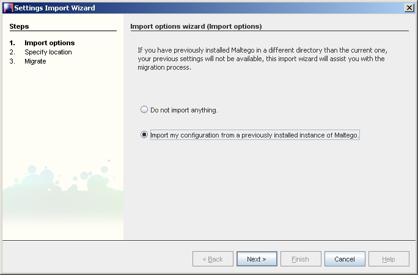

# Переход от версии 2.0 к версии 2.0.1

## Содержание

  -   [1 Примечание](http://ctas.paterva.com/view/Migration_from_older_versions#Important_Notice)
  -   [2 Переход от версии 2.0 к версии 2.0.1](http://ctas.paterva.com/view/Migration_from_older_versions#Migrating_From_2.0_to_2.0.1)
      -   [2.1 Windows Vista](http://ctas.paterva.com/view/Migration_from_older_versions#Windows_Vista)
      -   [2.2 Windows XP / Linux](http://ctas.paterva.com/view/Migration_from_older_versions#Windows_XP_.2F_Linux)

**Warning**: Вы должны следовать данным инструкциям только при условии, что вы изменяли настройки принципов преобразования и поиска, создавали новые объекты или их множества. Если вы не изменяли ничего из вышеперечисленного, то вы можете сразу приступить к использованию Maltego 2.0.1.

## Переход от версии 2.0 к версии 2.0.1

### Windows Vista

Мастер настройки импорта не работает под операционной системой Vista.

Потому, что Vista использует виртуализированную директорию ‘Program Files’. В версии 2.0.1 все настройки сохраняются в директориях пользователя – другими словами – в будущих версиях Maltego переходы между версиями будут менее «болезненными». Все, что вам нужно на данный момент – следовать этой инструкции.

После скачивания и установки версии 2.0.1, требуется сделать следующее:

**Шаг 1:** Запустите версию 2.0 – предыдущую версию. Перейдите Help-&gt;About Maltego. (Помощь-&gt;О Maltego). Выберите лицензионный ключ и скопируйте его в буфер обмена (или перепишите куда-либо).


**Шаг 2:** Используя файл-менеджер системы Vista, откройте следующую папку:

```
C:\\Users\\<имя вашего пользователя>\\AppData\\Local\\VirtualStore\\Program Files\\Maltego
```
Папка AppData (Данные приложения) является скрытой по умолчанию.


Внутри этой директории находится древо XML файлов – MaltegoServers.xml (the TAS servers), MaltegoTransforms.xml (ваши преобразования) и transformSets.xml (ваши настройки). Эти файлы относятся к версии Maltego 2.0.0.

**Шаг 3:** В другом окне откройте следующую папку:

```
C:\\Users\\<имя вашего пользователя>\\AppData\\Roaming\\.maltego\\v2.0.1
```


Выберите все XML файлы, перечисленные в Шаге 2 и скопируйте их в эту директорию, переписывая файлы, уже находящиеся в ней. Это гарантирует, что ваши настройки сохранятся. Заметьте, что файл лицензионного ключа (MaltegoLicense.lic) не может быть использован для новой версии программы, вам нужно будет активировать его повторно, как описано в Шаге 4.

**Шаг 4:** Все, что осталось сделать – ввести лицензионный ключ (который вы скопировали из установленной версии 2.0 в Шаге 1). Это делается во вкладке Help-&gt;Activate product (Помощь-&gt;Активировать продукт):


Нажмите «Далее» и введите свой ключ из Шага 1:


Нажмите кнопку «Далее» снова, для завершения работы мастера. По окончании Maltego 2.0.1 будет работать точно так же, как предыдущая версия – 2.0. Поэтому, на этом этапе вы можете удалить старую версию программы.

### Windows XP / Linux

Если у вас установлена версия 2.0, и вы хотите сохранить изменения, сделанные вами, например, для принципов преобразования данных (Transforms) и наборов конфигураций для преобразования данных, то вы должны следовать мастеру переноса настроек. Если же вы ничего из этого не изменяли, то вам не нужно ничего переносить.

После загрузки и установки версии 2.0.1 сделайте следующее:  
**Шаг 1:** Запустите версию 2.0 – предыдущую версию. Перейдите Help-&gt;About Maltego. (Помощь-&gt;О Maltego). Выберите лицензионный ключ и скопируйте его в буфер обмена (или перепишите куда-либо).


**Шаг 2:** Запустите версию 2.01. Версия 2.01 имеет немного другой значок, и немного другую стартовую страницу. При запуске появится мастер импорта параметров. Если этого не произойдет, то вы можете запустить его из вкладки Help-&gt;Import settings Wizard (Справка-&gt; Мастер настройки Импорта):



Выберите пункт “Import my configuration from a previously installed instance of Maltego” (Импортировать конфигурации из предыдущей установленной версии Maltego).

**Шаг 3:** Нажмите «Далее» и выберите директорию, в которую вы ранее устанавливали Maltego. Так как Maltego может быть установлен на различные платформы (такие, как Linux / MacOS) и, так как нет основной концепции реестра, то вы должны самостоятельно выбрать директорию. Выбор по умолчанию директории должен указать вам на директорию установки версии 2.0 по умолчанию:

**Windows**: Директория установки по умолчанию c:\\Program Files\\Maltego\\

**Linux**: Директория установки по умолчанию \~/Maltego/


Мастер импортирует сервера TAS (TAS servers), преобразования (Transforms) и настройки (sets). Если директория не содержит их, они будут отмечены как неактивные.

**Шаг 4:** Нажмите кнопку «Далее», а затем «Готово», чтобы завершить работу мастера:


**Шаг 5:** Все, что осталось сделать – ввести лицензионный ключ (который вы скопировали из установленной версии 2.0 в Шаге 1). Это делается во вкладке Help-&gt;Activate product (Помощь-&gt;Активировать продукт):


Нажмите «Далее» и введите свой лицензионный ключ из Шага 1:


Нажмите «Далее» и завершите работу мастера. Когда все будет готово, ваша копия Maltego 2.0.1 будет работать так же, как и 2.0. На этом этапе вы можете удалить свою копию программы 2.0.
